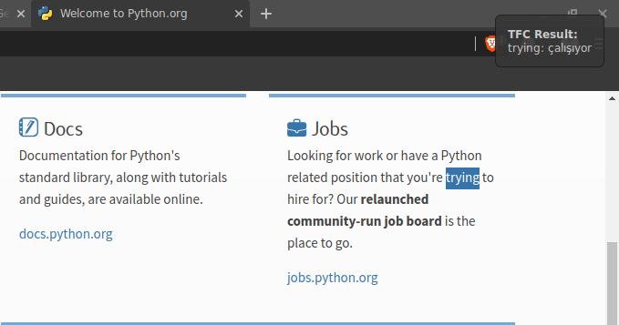
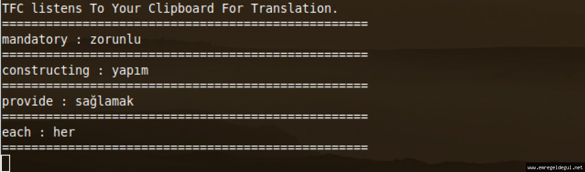

# TFC
Translate From The Clipboard (Simple Translate App From The Clipboard)



TFC listens to the clipboard and translates the copied words using Yandex Translate. It shows translations as notifications.



# Setup
Firstly, take a Yandex Translate API key.

**Yandex Translate API:** https://tech.yandex.com/translate/doc/dg/concepts/about-docpage/

After taking the API key, create a config file as `.tfc.config.json` on **home** directory.

It should look like this:

```json
{
    "key": "YandexTranslateKey",
    "lang": "en-tr"
}
```
Ok. Now you can download and install the project.

```bash
~$ git clone https://github.com/emregeldegul/tfc && cd tfc
~$ pip install -r requirements.txt
~$ python setup.py install
```

That's it. You can now run the program from the terminal by writing `tfc`.

```bash
~$ tfc
```

# Project Idea

I was learning English and every time I encountered with a word that was strange to me, I was looking to its meaning from dictionaries. It was difficult, repetitive and unnecessary. Because of my own necessity and problem I developed this project.

Previously, Ömer Faruk Bayram had written a similar project. But he deleted the project. So I wrote it from scratch.
